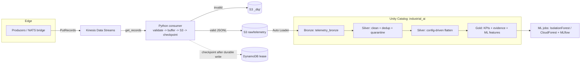

# industrial-ai-platform-aws

AWS-native implementation of the Azure `industrial-ai-platform` — a
**domain-agnostic** industrial-telemetry lakehouse. One generic event envelope,
one ingestion path, one Bronze→Silver→Gold pipeline, and configuration-driven
asset onboarding, so vehicles, wind turbines, PLCs, pumps, motors, and future
asset types are supported by **adding a YAML file, not changing code**.
Bearing/CWRU + Isolation Forest are the reference/validation workload, not the
platform's domain model.

> **Status: AMBER (code-complete, verified offline/emulated; not yet deployed).**
> 171 tests pass; Terraform is hcl2-clean + checkov-scanned; no secrets. Live
> `terraform apply` / Databricks deploy / GitHub Actions runs are the remaining
> steps and are **NOT EXECUTED** here (require your AWS account). See
> `docs/PRODUCTION_READINESS.md`.

## Why it exists

A reusable, governed, reproducible platform for streaming industrial telemetry
into an analytics + ML lakehouse, with production hardening (at-least-once
delivery, leakage-safe ML, least-privilege security, IaC) carried over 1:1 from
the hardened Azure reference.

## Architecture



## Data flow (contract)

`event_id, device_id, asset_type, timestamp, priority, schema_version, payload`
(Pydantic, `extra=forbid`, identity fields `min_length=1`). Invalid → S3 DLQ.
Valid → buffered → written to S3 as JSONL → **checkpoint only after the durable
write** (at-least-once; Silver dedup by `event_id` makes replay idempotent).

## AWS service selection (why each)

| Concern | Service | Rationale |
|---|---|---|
| Streaming bus | Kinesis Data Streams | shard-ordered, replayable (Event Hubs analogue) |
| Raw/medallion store | S3 | durable, immutable, native Auto Loader source |
| Checkpoint state | DynamoDB lease (prod) / file (dev) | KCL-native, durable, shared |
| Compute + governance | Databricks on AWS + Unity Catalog | portable DLT + catalog governance |
| Secrets / keys | Secrets Manager + KMS CMKs | no committed secrets; rotation |
| Identity | IAM roles + GitHub OIDC | no static credentials |
| Observability | CloudWatch + CloudTrail | lag/DLQ/failure alarms + audit |
| Network | VPC + endpoints | private data plane, no public S3 |
| Registry | ECR | scanned consumer image |

Detail: `docs/AZURE_TO_AWS_MAPPING.md`, `docs/CROSS_CLOUD_PARITY.md`.

## Repository layout

```
shared/ config/           domain core (envelope, settings, asset_types) — cloud-free
consumer/                 Kinesis consumer, S3 client, DynamoDB/file checkpoint, batch buffer
edge/                     Kinesis producer, vehicle simulator, NATS bridge (translate)
dlt/                      Bronze/Silver/Gold DLT notebooks (byte-identical to Azure)
ml/  notebooks/           IsolationForest / CloudForest / feature spec / maintenance / MLflow backup
databricks.yml            Databricks Asset Bundle (S3 bronze_path)
terraform/                bootstrap + 12 modules + environments/{dev,dev-databricks}
.github/workflows/        AWS-OIDC CI/CD (tests, terraform, databricks, deploy)
tests/                    unit / contract / DQ / moto / local-Spark / ML / failure
docs/                     baseline, parity, acceptance, security, cost, failure, observability, evidence
```

## Domain-agnostic onboarding

Add `config/asset_types/<type>.yml` (asset_type, silver_table, field mappings).
No Python change. Proven by `tests/test_asset_type_config.py` and the local-Spark
flatten tests. `wind_turbine.yml` ships purely to demonstrate this.

## Security model

No static credentials (IAM roles + GitHub OIDC). KMS CMKs everywhere; S3 Block
Public Access + TLS-only; least-privilege runtime roles; CloudTrail; VPC
endpoints; `prevent_destroy` on critical buckets. `docs/AWS_SECURITY_REVIEW.md`.

## Observability

CloudWatch alarms (consumer lag, no-incoming, DLQ) on real metrics; runbooks in
`docs/runbooks/OPERATIONS.md`. `docs/OBSERVABILITY.md` maps the 12 pipeline
questions to signals.

## CI/CD

GitHub Actions with AWS OIDC (`role-to-assume`, `id-token: write`) — no static
keys. Stages: pytest + pip-audit; terraform fmt/validate/checkov/plan + apply
gate; databricks bundle validate/deploy gate. `docs/evidence/cicd-evidence.md`.

## Testing

171 passed / 11 skipped: unit + contract + DQ + moto (Kinesis/S3/DynamoDB) +
local Spark (Silver/Gold) + sklearn (ML reproducibility) + failure-recovery.
`docs/evidence/*`. Run:

```bash
pip install -r requirements.txt scikit-learn "pyspark==3.5.3"
SPARK_LOCAL_IP=127.0.0.1 python -m pytest tests/ -v
```

## Deployment

See `docs/evidence/aws-deployment-evidence.md` for the exact bootstrap → core →
UC → bundle sequence. Nothing account-specific is committed; fill the
`*.example` files.

## Recovery

Failure-engineering suite (`tests/test_failure_recovery.py`) + runbooks.
At-least-once with zero loss after last flush; DLQ replay; checkpoint restart
recovery. `docs/AWS_FAILURE_ENGINEERING.md`.

## Cost

Drivers + dev/small/medium/large tiers (no fabricated prices — use the AWS
Pricing Calculator). `docs/AWS_COST_AND_SCALE.md`.

## Known limitations

- Live `terraform apply`, Databricks workspace + bundle deploy, and GitHub
  Actions runs are **NOT EXECUTED** here (need your AWS/Databricks accounts).
- Databricks **workspace** creation is account-level (not in the UC module).
- CI deploy IAM role is broad (R1) — tighten before prod.
- End-to-end Scenario F/B/mode-history through deployed Gold tables is verified
  at the generator level only until a live pipeline runs.

## Cleanup

`terraform destroy` in `environments/dev-databricks`, then `environments/dev`,
then `bootstrap` (remove `prevent_destroy` blocks intentionally first). Empty +
delete versioned buckets. Delete the Databricks bundle: `databricks bundle destroy -t dev`.
